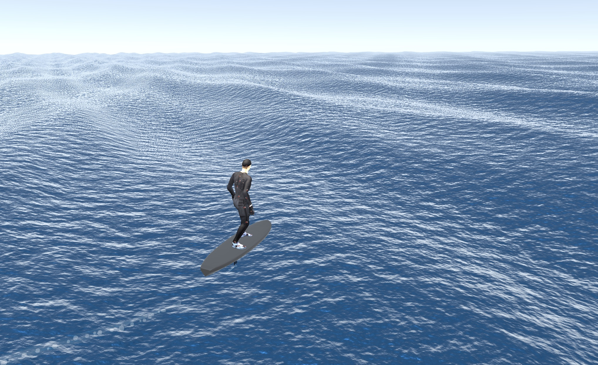

# Downwind Foil Sim

A browser-based hydrofoil downwind riding simulator vibe coded with Three.js and TypeScript.

**[Live demo →](https://usedwatersports.com/downwind-sim)**



## What it is

Simulates riding a hydrofoil board downwind on open ocean swells. The physics model captures the key skill of downwind foiling: finding and linking wave bumps to maintain flight. Ride the downhill faces of waves to accelerate, pump to stay on foil, and try not to crash.

## Physics

- **Wave energy propulsion** — gravity acting on wave slopes is the primary source of speed, just like real downwind foiling
- **Lift/stall model** — lift scales with speed²; fall below stall speed and the foil drops
- **Drag** — profile drag + induced drag (proportional to lift²), plus a wetted-surface penalty when skimming low
- **Multi-point wave sampling** — wave height sampled at board center and both wingtips each frame, generating realistic wave-induced roll torques
- **Pump mechanic** — spacebar delivers a forward impulse at the cost of stamina energy
- **Two foil presets** — High Aspect Race (fast, unforgiving) and Mid Aspect Cruise (slower, more stable)

See [`foil-physics.md`](foil-physics.md) for the full physics spec.

## Controls

| Key | Action |
|-----|--------|
| ← → | Roll / turn |
| ↑ ↓ | Pitch |
| Space | Pump |
| C | Toggle chase / orbit camera |
| R | Restart after crash |

## Stack

- [Three.js](https://threejs.org/) — rendering
- [lil-gui](https://lil-gui.georgealways.com/) — debug panel
- [Vite](https://vite.dev/) + TypeScript

## Dev

```bash
npm install
npm run dev
```
